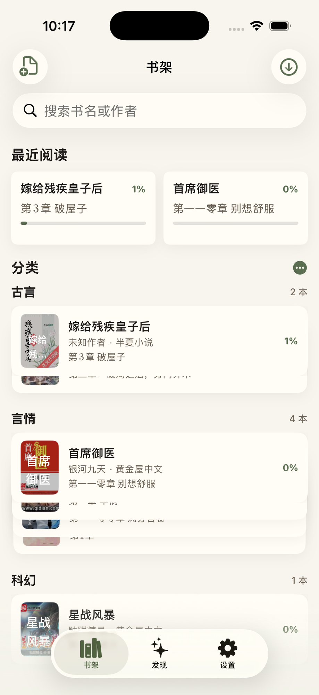
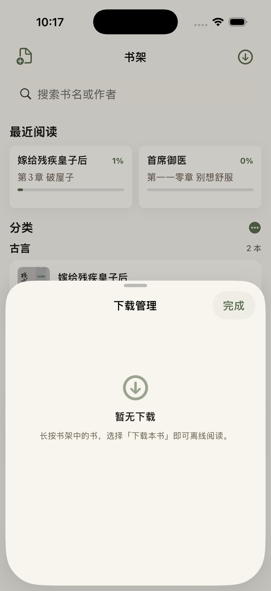
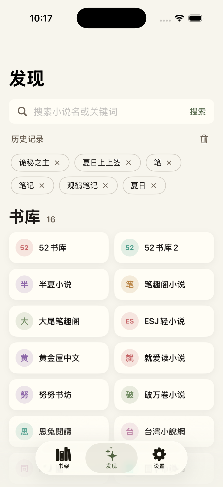
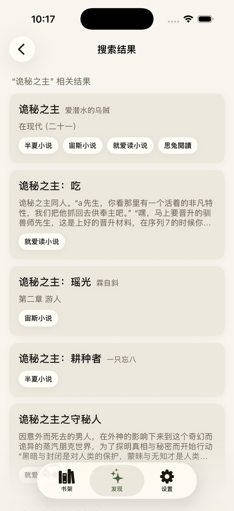
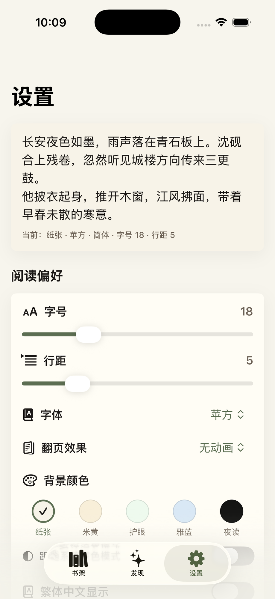
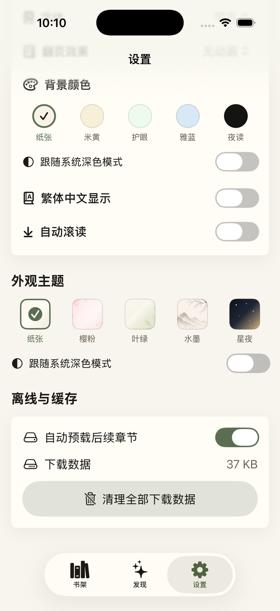

# 灵阅书屋 (Lingyue)

A polished, theme-rich Chinese-language novel reader for iOS. Browse 16 source sites, import full books with one tap, organize them in a wallet-stacked library, and read with typography that matches the platform — five page tints, five fonts, three page-turn animations, and Apple Books-style reveal of the status bar and chrome.

iOS 17+ · SwiftUI · Single-window app · Bundle id `com.lingyue.reader`

---

一款专为中文小说打造的精致 iOS 阅读器。聚合 16 个书源，一键导入整本书，用钱包式堆叠分类管理书库；五种页面底色、五种字体、三种翻页动画，状态栏和工具栏的显隐遵循 Apple Books 的交互习惯。

iOS 17+ · SwiftUI · 单窗口应用 · 包名 `com.lingyue.reader`

## Features / 功能

### Library / 书架

 

The Library tab uses a wallet-stacked categorized layout: each shelf collapses to a stack of cover spines, tap to fan out, tap again to collapse. A 最近阅读 strip is pinned at the top with the most-recently-opened books and their progress, and a navigation-drawer search box matches across every imported book by title or author. Mail-style swipes expose 下载 and 清理缓存 on the left, 删除 on the right; long-press a book to assign it to a category. The toolbar's download button opens a 下载管理 sheet that lists every active or paused chapter download.

书架采用「钱包堆叠」式分类布局：每个分类默认收成一叠书脊，轻点展开，再点收回。顶部固定「最近阅读」横排，按打开时间倒序展示当前阅读进度；导航栏下方的搜索框可跨分类按书名或作者搜索全部书籍。书本左滑展示「下载 / 清理缓存」，右滑展示「删除」；长按可指定或调整分类。右上角的下载按钮可调出「下载管理」弹层，集中查看正在下载或已暂停的章节任务。

### Discovery / 发现

 

Discovery aggregates **16 source sites** behind a single search box: results stream in as each source replies, and a single book that exists on multiple sources is grouped under one row with the matched sources listed as chips. A 历史记录 strip remembers recent queries for one-tap re-run, and tapping any source tile opens its homepage in the in-app browser. Sources include 破万卷小说, 大尾笔趣阁, ESJ轻小说, 思兔閱讀, 就爱读小说, 同人圈, 笔趣阁小说, 52书库, 努努书坊, 宙斯小说, 同人小说网, 台灣小說網, 黄金屋中文, 半夏小说, 52书库2, and 无忧书城.

「发现」页用同一个搜索框聚合 **16 个书源**：每个书源返回结果后即刻流式展示，多个书源同时收录的同一本书会合并成一行，并以小标签列出来源。「历史记录」保留最近搜索词，可一键重搜；点击任意书源磁贴可在内置浏览器中打开其首页。已接入书源：破万卷小说、大尾笔趣阁、ESJ轻小说、思兔閱讀、就爱读小说、同人圈、笔趣阁小说、52书库、努努书坊、宙斯小说、同人小说网、台灣小說網、黄金屋中文、半夏小说、52书库2、无忧书城。

### Reader / 阅读器

The reader offers five page themes (纸张, 米黄, 护眼, 雅蓝, 夜读 — the night theme can follow the system appearance), five Chinese fonts (苹方, 宋体, 楷体 via the bundled LXGW WenKai Screen, 黑体, 圆体), and three page-turn animations (无动画 / 滑动 / 仿真翻页). Tap the page once to reveal the top and bottom bars together with the status bar in Apple Books style — and the body text stays pinned across the reveal so paragraphs never reflow. Auto-scroll, in-reader live preferences, a 简/繁 conversion toggle, and a chapter list overlay with progress are all one tap away.

阅读器提供 5 种页面底色（纸张 / 米黄 / 护眼 / 雅蓝 / 夜读，夜读可跟随系统深色模式自动切换）、5 种字体（苹方、宋体、楷体（内置 LXGW 文楷 Screen）、黑体、圆体）、以及 3 种翻页动画（无动画 / 滑动 / 仿真翻页）。轻点页面即可仿照 Apple Books 同时显示顶部与底部工具栏及状态栏，正文位置在显隐切换时保持不动，不会重新分页。自动滚读、阅读页内的实时偏好弹层、简繁切换以及带进度条的章节列表都触手可及。

### In-app browser / 内置浏览器

Open any source homepage in the built-in browser; it auto-detects book pages and offers a one-tap 导入到书架 import. The chrome and background follow the selected app theme, and the web view itself is transparent so the theme reads through during loading.

可在内置浏览器中打开任一书源首页，自动识别书籍页并提供「导入到书架」一键导入。浏览器的顶栏、底部控制栏与背景跟随当前外观主题；网页本身使用透明背景，加载过程中也能透出主题色。

### Settings / 设置

| Reader preferences | App theme & storage |
| --- | --- |
|  |  |

Settings opens with a live typography preview rendering a sample passage in the current 字号 / 行距 / 字体 / 翻页效果 / 背景颜色, plus a one-line summary so each change is visible without leaving the screen. Below the preview, three sections cover **阅读偏好** (font, size, line spacing, page transition, background color, follow-system-dark, traditional Chinese, auto-scroll), **外观主题** (the five app-wide themes — 纸张, 樱粉, 叶绿, 水墨, 星夜 — with their own follow-system-dark toggle), and **离线与缓存** (auto-preload upcoming chapters, total download size, and a bulk-clear button).

设置页顶部是排版实时预览：用当前的字号 / 行距 / 字体 / 翻页效果 / 背景颜色渲染一段示例文字，并附上一行参数摘要，调整时即刻可见。下方分三个板块：「阅读偏好」（字号、行距、字体、翻页效果、背景颜色、跟随系统深色模式、繁体中文显示、自动滚读）、「外观主题」（5 套全局主题：纸张 / 樱粉 / 叶绿 / 水墨 / 星夜，并提供独立的跟随系统深色模式开关）、以及「离线与缓存」（自动预载后续章节、累计下载数据大小、一键清理全部下载数据）。

## Tech / 技术栈

- **Language / UI**: Swift, SwiftUI, with UIKit interop where it matters (a custom `UIPageViewController` for the page-curl animation, `WKWebView` for the in-app browser).
- **Persistence**: `@AppStorage` for preferences, file-system JSON for the library and downloaded chapters.
- **Theming**: an `AppTheme` environment value drives a single `ThemeBackgroundView` that every top-level scene layers content over; the reader has its own `ReadingTheme` for page tints.
- **Fonts**: bundles `LXGWWenKaiScreen.ttf` (open-source) registered via `UIAppFonts`; other faces resolve to on-device Hiragino fallbacks.
- **Deployment target**: iOS 17.0.

- **语言 / UI**：Swift、SwiftUI，必要处与 UIKit 互通（仿真翻页基于自定义 `UIPageViewController`，内置浏览器基于 `WKWebView`）。
- **持久化**：偏好用 `@AppStorage`；书库与下载章节落到本地 JSON 文件。
- **主题**：环境值 `AppTheme` 驱动同一个 `ThemeBackgroundView`，所有顶层页面在其之上叠加内容；阅读器另有 `ReadingTheme` 控制页面底色。
- **字体**：内置开源 `LXGWWenKaiScreen.ttf`，通过 `UIAppFonts` 注册；其余字体回退到系统 Hiragino 字族。
- **部署目标**：iOS 17.0。

## Build / 构建

```bash
open lingyue.xcodeproj
```

Build the `lingyue` scheme against an iOS 17 simulator or device. No external dependencies, no package manager — everything is in-tree.

```bash
xcodebuild -project lingyue.xcodeproj \
           -scheme lingyue -configuration Debug -sdk iphonesimulator \
           -destination 'generic/platform=iOS Simulator' build
```

打开 `lingyue.xcodeproj`，选择 `lingyue` scheme，针对 iOS 17 模拟器或真机构建即可。无第三方依赖，无包管理工具，所有源码均在仓库内。
