# 灵阅书屋 (Lingyue)

一款专为中文小说打造的精致 iOS 阅读器。聚合多个书源，一键导入整本书，用钱包式堆叠分类管理书库；五种页面底色、五种字体、三种翻页动画，状态栏和工具栏的显隐遵循 Apple Books 的交互习惯。

iOS 17+ · SwiftUI · 单窗口应用 · 包名 `com.lingyue.reader`

---

## 使用指南

灵阅支持在「书源」页面通过 **手动添加 / 从 JSON 文件导入 / 从网址导入** 三种方式添加书源。下面先讲如何**手动添加一个书源**（以公版的维基文库为例），再讲如何**导入现成的 JSON**，以及如何**把书源分享给别人**。

> 进入「书源」页的路径：底部「**发现**」标签 → 右上角「**地球**」图标。下文统称「书源」页。

### 手动添加书源（以维基文库为例）

「手动添加」让灵阅根据你**在浏览器里实际打开过的几个页面 URL** 自动识别书源结构，你不必懂任何选择器或正则。

**① 进入「书源」页，点右上角「＋」→「手动添加」。**

**② 填写下表。** 只有**书源主页**必填，其余「示例 URL」建议尽量都填——给得越全，自动识别越准：

| 字段 | 含义 | 维基文库示例 |
|---|---|---|
| **书源主页 URL**（必填） | 网站首页 | `https://zh.wikisource.org/` |
| 书源名称（可选） | 留空则取网站标题 | `维基文库` |
| 书籍详情页 URL | 一本书的总目录页 | `https://zh.wikisource.org/wiki/紅樓夢` |
| 章节正文 URL | 其中某一章的正文页 | `https://zh.wikisource.org/wiki/紅樓夢/第001回` |
| 搜索结果页 URL | 站内搜索某关键词后的结果页 | `https://zh.wikisource.org/w/index.php?search=紅樓夢&fulltext=1&ns0=1` |
| 搜索时使用的关键词 | 上面那个搜索 URL 里实际搜的词 | `紅樓夢` |

**③ 点右上角「分析」。** 灵阅会抓取这些页面、自动推断出「搜索 / 目录 / 章节正文」的解析规则，并进入「**书源详情**」审核页。

**④ 在审核页逐个点「测试」** 验证「搜索 / 目录 / 章节」是否正常；个别环节识别不准时，点「**高级修复（手动编辑规则）**」微调。

**⑤ 点「保存与启用」完成。** 该书源随即出现在列表中，「**发现**」页也能直接搜到它的书。

> 小贴士：那几个示例 URL 直接从浏览器地址栏复制最稳妥——确保它们是你**确实能打开**的真实页面。维基文库、古腾堡、公版经典这类**版权自由**的站点最适合拿来练手，分享出去也没有任何顾虑。

### 导入现成的书源 JSON

如果别人已经给了你一份打包好的书源配置文件（JSON 格式），用下面任意一种方式导入即可。

#### 从 JSON 文件导入

1. 把 `*.json` 文件保存到 iPhone 的「文件」App（iCloud Drive、本机或任意位置都可以）
2. 进入「书源」页，点右上角「**＋**」→「**从 JSON 文件导入**」
3. 在文件选择器里选中该 JSON 文件
4. 确认对话框会提示「新增 / 覆盖 / 未变更」的条数，点「**导入**」完成

#### 从网址导入

如果配置已经托管在网上（一个能直接返回 JSON 原文的网址），不必先下载到本地：

1. 进入「书源」页，点右上角「**＋**」→「**从网址导入**」
2. 粘贴指向该书源 JSON 文件的 `http(s)` 网址（只填域名时会自动补全为 `https://`），点「**导入**」
3. 灵阅会下载该配置，同样弹出「新增 / 覆盖 / 未变更」确认，确认后完成

> 也可以用 `lingyue://import?url=<网址>` 深链一键唤起导入。两种网址方式与「从 JSON 文件导入」逻辑完全一致，只是来源换成了远程链接；请确认你有权访问该网址的内容。

导入完成后，「**发现**」页的搜索框就能跨所有已启用的书源搜索了。

### 把书源分享给别人

在 App 内选中书源就能直接导出成一份**书源 JSON 文件**，发给别人导入。

**导出步骤：**

1. 进入「书源」页，点右上角「**选择**」进入多选模式
2. 勾选要分享的书源（只有自己添加的书源可选）
3. 点底部的「**导出**」按钮（分享图标）
4. 在系统弹出的存储 / 分享面板里选「**存储到文件**」「**隔空投送**」等方式发出去

**文件长什么样？** 一个信封套着一个 `sources` 数组，数组里每个元素就是一个书源规则：

```json
{
  "kind": "lingyue-sources",
  "version": 1,
  "sources": [
    {
      "id": "00000000-0000-0000-0000-000000005701",
      "schemaVersion": 1,
      "name": "维基文库",
      "homepage": "https://zh.wikisource.org/",
      "capabilities": { "supportsSearch": true, "showInSearchBar": true },
      "search":  { "…": "搜索规则" },
      "detail":  { "…": "书籍详情规则" },
      "catalog": { "…": "章节目录规则" },
      "chapter": { "…": "正文提取规则" }
    }
  ]
}
```

> 其中 `kind` 固定为 `lingyue-sources`，是灵阅用来识别书源文件的标记。`capabilities` 与 `search / detail / catalog / chapter` 内部的选择器等字段为方便阅读已省略——它们都是「**手动添加 → 分析**」自动生成的，一般不用手写。

**对方怎么导入？** 两种方式：

- **发文件**——把导出的 `.json` 发给对方，对方用「**从 JSON 文件导入**」。
- **挂网址**——把 JSON 放到一个能直接返回原文的网址（raw 链接），对方用「**从网址导入**」或 `lingyue://import?url=…` 深链一键导入。

> 想整机迁移（书架 + 书源 + 统计）请用 **我 → 数据 → 导出备份**；那是整机备份，导入会**覆盖**对方的全部数据，**不适合**用来分享书源。

### 导入本地小说文件

除了从书源搜索下载，也可以把手头已有的小说文件直接导入书架。目前支持 **TXT / EPUB / HTML** 三种格式：

1. 把文件保存到 iPhone 的「文件」App（AirDrop、邮件附件、iCloud Drive 等任意方式均可）
2. 打开灵阅，切到底部「**书架**」标签
3. 点击左上角的「**＋**」按钮
4. 在文件选择器里选中要导入的文件

各格式的处理方式略有差异：

- **TXT** — 自动识别 `第 N 章 / 节 / 回 / 卷 / 页` 的章节标题（支持阿拉伯数字与「一二三十百千万」中文数字）拆分章节；没有识别到任何章节标题时则作为单章导入。文件名（去掉扩展名）作为书名，作者默认「未知作者」。支持的文件编码：**UTF-8 / GB18030 / Big5**。
- **EPUB** — 读取 `META-INF/container.xml` 与 OPF 包文件，按 `<spine>` 的阅读顺序逐章导入，章节标题取自每个 XHTML 的第一个 `<h1>-<h6>` 标题。书名与作者优先使用 EPUB 元数据里的 `<dc:title>` / `<dc:creator>`。
- **HTML** — 把整页 HTML 去除标签后按 TXT 同样的章节规则拆分；书名优先使用 `<title>`，否则回落到文件名。

> 同名书籍再次导入会**覆盖**原书的章节内容，可用于更新或修正本地小说。单个文件最大 100 MB。

---

## 功能

### 书架

<p>
  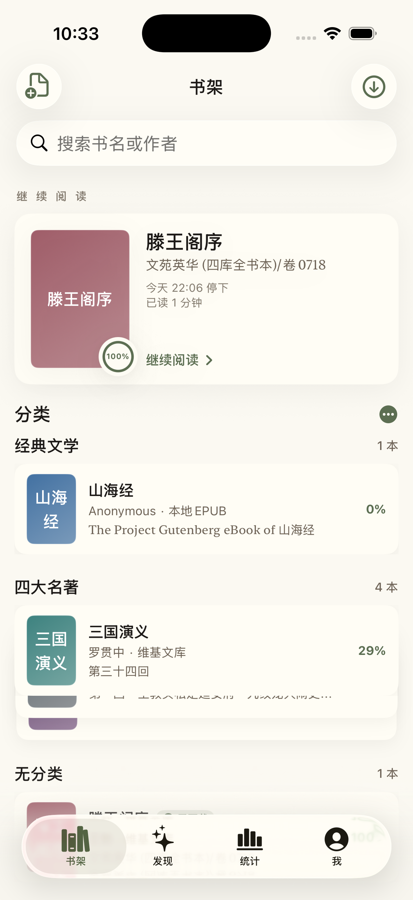
  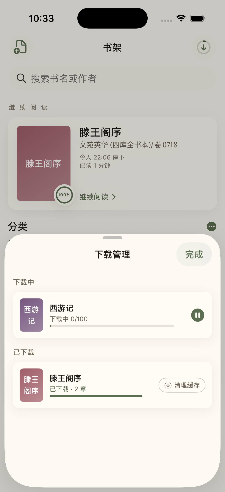
</p>

书架采用「钱包堆叠」式分类布局：每个分类默认收成一叠书脊，轻点展开，再点收回。顶部固定「最近阅读」横排，按打开时间倒序展示当前阅读进度；导航栏下方的搜索框可跨分类按书名或作者搜索全部书籍。书本左滑展示「下载 / 清理缓存」，右滑展示「删除」；长按可指定或调整分类。左上角的「文件 ＋」按钮直接导入本地 TXT / EPUB / HTML 小说，右上角的下载按钮可调出「下载管理」弹层，集中查看正在下载或已暂停的章节任务。

### 发现

<p>
  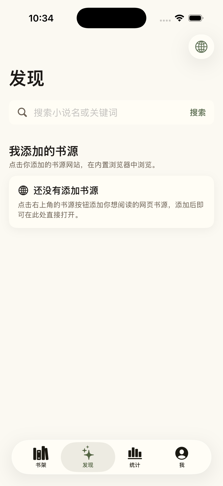
  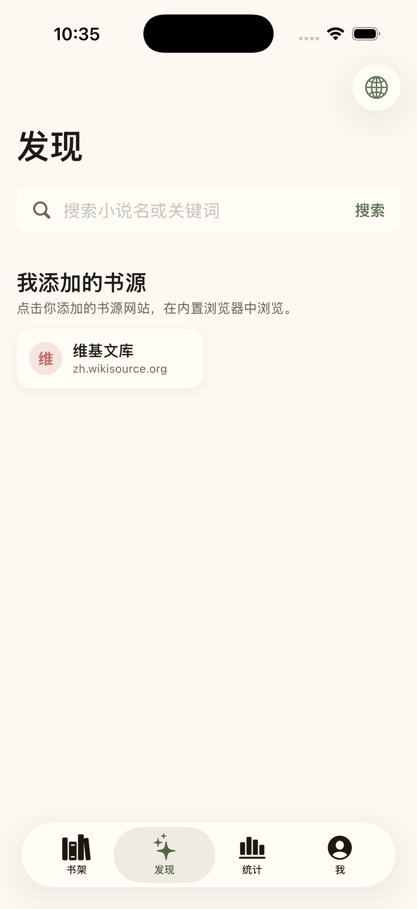
  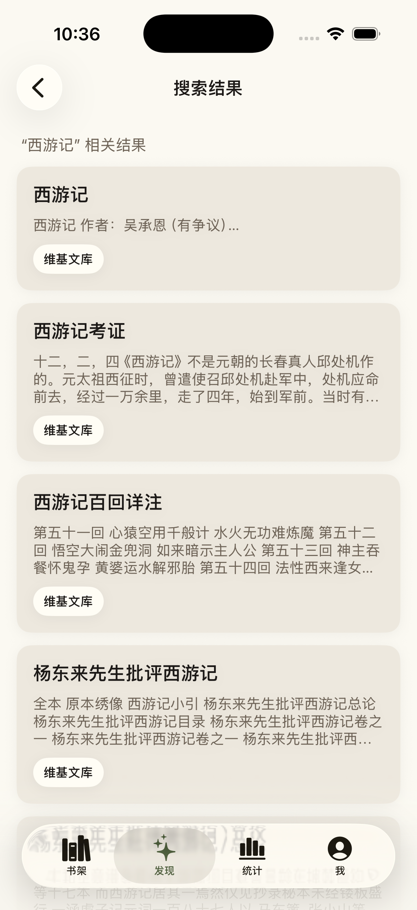
  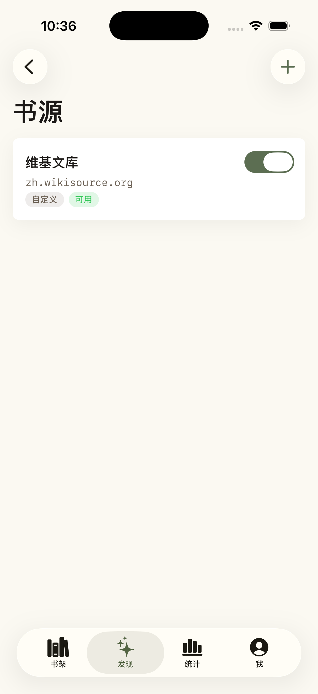
</p>

「发现」页用于跨多个书源聚合搜索。添加了书源后（在「书源」页通过 JSON 导入、URL 分析或手动新建），「我添加的书源」区会列出每一个站点磁贴，轻点直接在内置浏览器中打开。顶部的搜索框聚合所有已启用的书源，每个书源返回结果后即刻流式展示，多个书源同时收录的同一本书会合并成一行并以小标签列出来源。右上角的「地球」按钮进入书源管理页面，可逐个启用 / 禁用，并通过「手动添加 / 从 JSON 文件导入 / 从网址导入」新增书源。

### 阅读器

<p>
  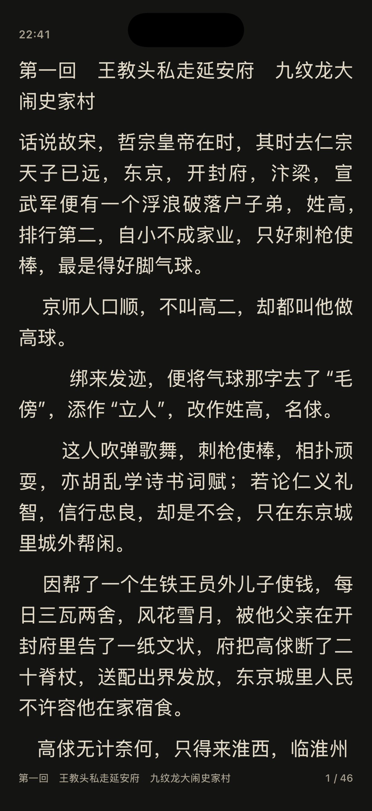
  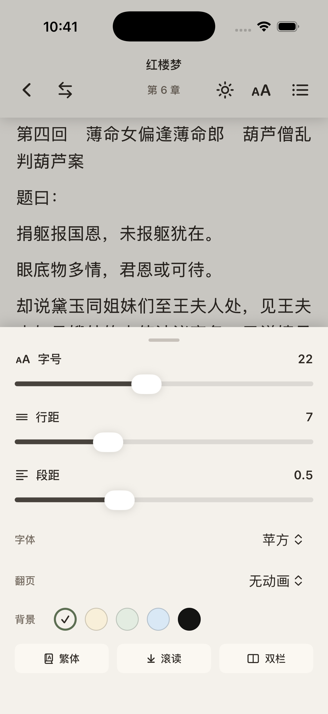
  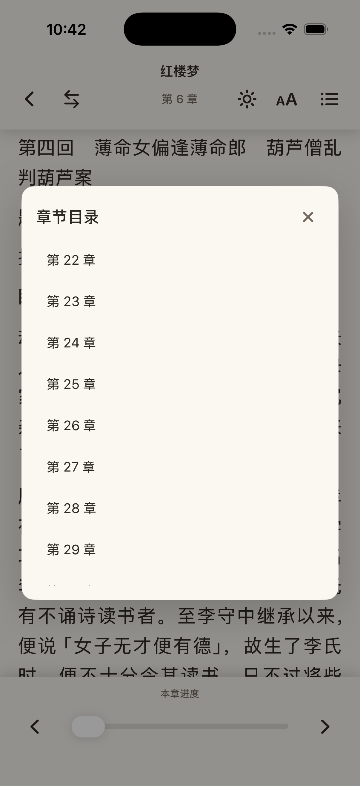
</p>

阅读器提供 5 种页面底色（纸张 / 米黄 / 护眼 / 雅蓝 / 夜读，夜读可跟随系统深色模式自动切换）、5 种字体（苹方、宋体、楷体（内置 LXGW 文楷 Screen）、黑体、圆体）、以及 3 种翻页动画（无动画 / 滑动 / 仿真翻页）。轻点页面即可仿照 Apple Books 同时显示顶部与底部工具栏及状态栏，正文位置在显隐切换时保持不动，不会重新分页。阅读页内的实时偏好弹层一处调整字号 / 行距 / 段距 / 字体 / 翻页效果 / 底色 / 繁体 / 自动滚读；右上角的章节列表带进度条，方便快速跳章。

### 统计

<p>
  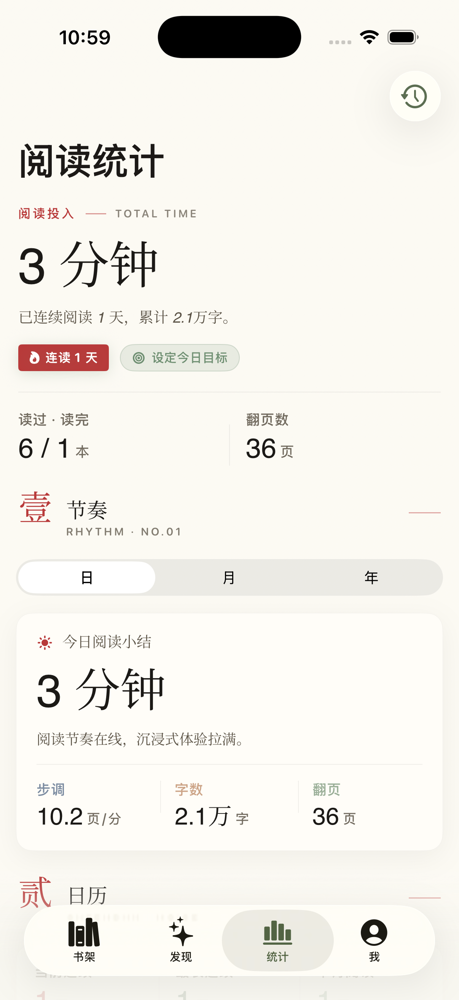
</p>

「统计」页把今日 / 本月 / 全年阅读时长、连续阅读天数、读过 / 读完本数、翻页数等核心指标都收在顶部「TOTAL TIME」卡片里；下方依次是日历热力图、按时段与按书籍的时长分布，以及把最近读完的章节和累计阅读量做成可分享的小卡片。

### 我

<p>
  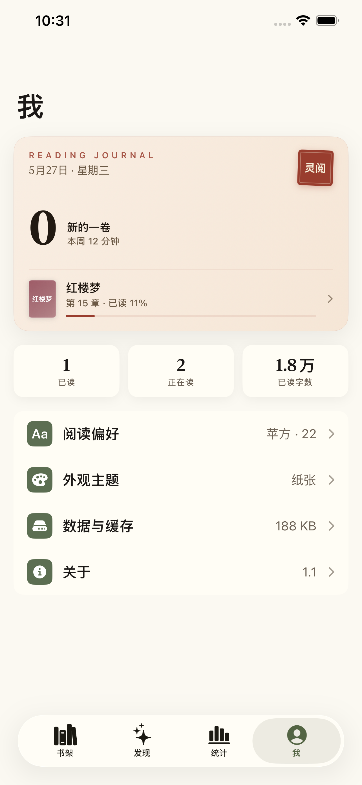
  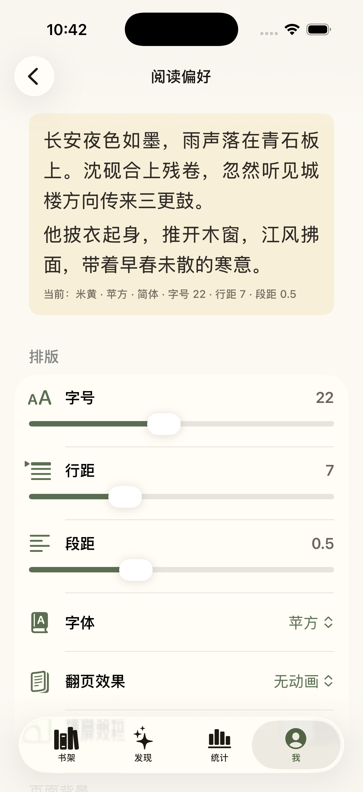
</p>

顶部是「Reading Journal」阅读身份卡，显示当日、本周连读天数与最近一本书的进度，轻点跳到「统计」标签；下方依次是「阅读偏好」（带活页预览的字号、行距、段距、字体、翻页效果、背景颜色、跟随系统深色模式、繁体中文、自动滚读）、「外观主题」、「数据与缓存」（自动预载、累计下载数据、一键清理），以及「关于」（版本号、GitHub 链接）。

### 外观主题

<p>
  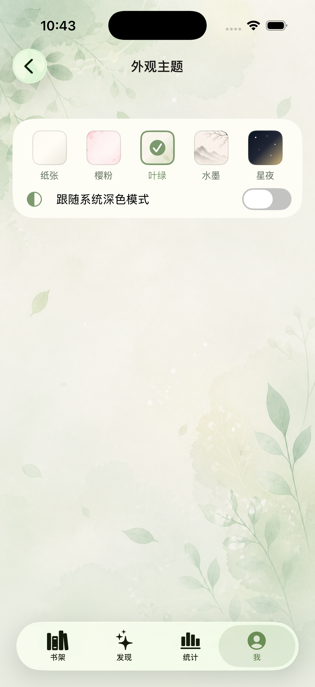
  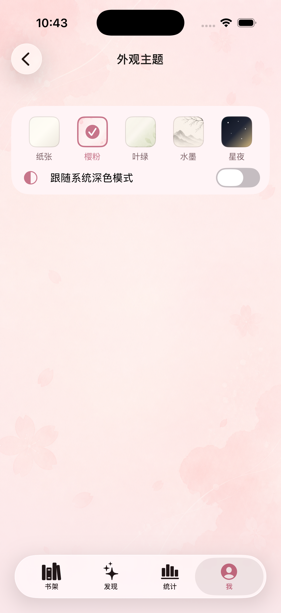
  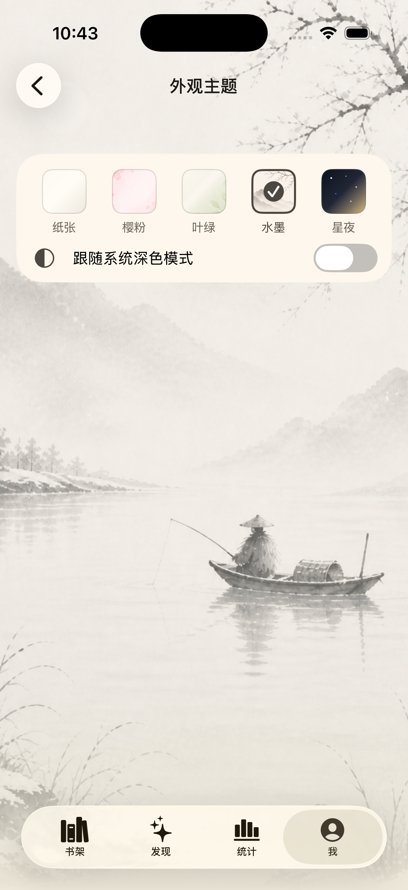
  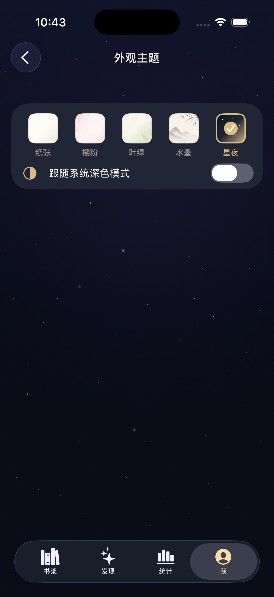
</p>

5 套全局主题：**纸张**（默认米白，见前文）、**樱粉**（淡粉樱瓣）、**叶绿**（青绿藤叶）、**水墨**（中国画山水）、**星夜**（深空繁星）。主题作用于所有顶层页面以及内置浏览器，「跟随系统深色模式」开关可让 App 在系统切到深色模式时自动切到星夜主题。

### 内置浏览器

<p>
  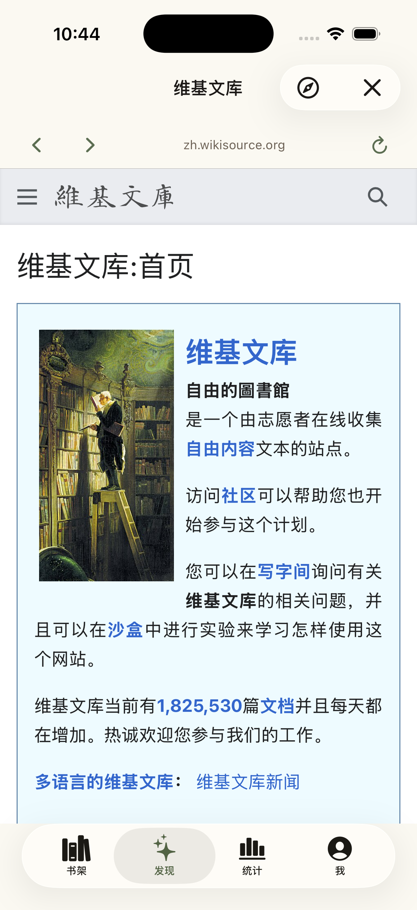
</p>

可在内置浏览器中打开任一书源首页，自动识别书籍页并提供「导入到书架」一键导入。浏览器的顶栏、底部控制栏与背景跟随当前外观主题；网页本身使用透明背景，加载过程中也能透出主题色。

## 技术栈

- **语言 / UI**：Swift、SwiftUI，必要处与 UIKit 互通（仿真翻页基于自定义 `UIPageViewController`，内置浏览器基于 `WKWebView`）。
- **持久化**：偏好用 `@AppStorage`；书库与下载章节落到本地 JSON 文件。
- **主题**：环境值 `AppTheme` 驱动同一个 `ThemeBackgroundView`，所有顶层页面在其之上叠加内容；阅读器另有 `ReadingTheme` 控制页面底色。
- **字体**：内置开源 `LXGWWenKaiScreen.ttf`，通过 `UIAppFonts` 注册；其余字体回退到系统 Hiragino 字族。
- **部署目标**：iOS 17.0。

## 构建

```bash
open lingyue.xcodeproj
```

打开 `lingyue.xcodeproj`，选择 `LingyueAppStore` scheme，针对 iOS 17 模拟器或真机构建即可。无第三方依赖，无包管理工具，所有源码均在仓库内。

```bash
xcodebuild -project lingyue.xcodeproj \
           -scheme LingyueAppStore -configuration Debug -sdk iphonesimulator \
           -destination 'generic/platform=iOS Simulator' build
```

---

# Lingyue Reader (English Overview)

A polished, theme-rich Chinese-language novel reader for iOS. Supports importing user-supplied source-rules JSON to aggregate-search across multiple sites.

iOS 17+ · SwiftUI · Bundle id `com.lingyue.reader`

## Tabs at a glance

- **Library (书架)** — wallet-stacked categorized shelves: collapse to spines, tap to fan out. A pinned 最近阅读 row tracks recently opened books; mail-style swipes expose download / cache-clear / delete; long-press to reassign category. A toolbar download-manager sheet centralizes active and paused chapter downloads. The top-left `doc.badge.plus` button imports a local **TXT / EPUB / HTML** file — TXT/HTML auto-split on `第 N 章` chapter headings; EPUB walks the `<spine>` for chapter order and pulls metadata from `<dc:title>` / `<dc:creator>`.

<p>
  
  
</p>

- **Discovery (发现)** — empty by default; once you add sources (via JSON import, URL-analyze, or manual creation in the Sources page) they show up as tiles in **我添加的书源**, tap one to open it in the in-app browser. The search box aggregates every enabled source; results stream in as each source replies, and the same book found on multiple sources collapses into one row with provenance chips. The globe icon opens **Sources** for enable/disable plus three ways to add a source: URL-analyze manual add, JSON file import, and remote-URL import (paste an `http(s)` link to a hosted book-source JSON).

<p>
  
  
  
  
</p>

- **Stats (统计)** — TOTAL TIME hero card with today / streak / books-finished / page-turn counters, a calendar heatmap, time-spent breakdowns by book and by hour, and shareable cards for recently finished chapters and lifetime totals.

<p>
  
</p>

- **Me (我)** — Reading Journal hero card (streak + lifetime characters read, taps over to Stats), plus reading preferences, app themes, data & cache management, and the About page (version, GitHub).

<p>
  
  
</p>

## Reader

Five page tints (纸张 / 米黄 / 护眼 / 雅蓝 / 夜读, with optional system-dark follow), five Chinese typefaces (苹方 / 宋体 / 楷体 via bundled LXGW WenKai Screen / 黑体 / 圆体), three page-turn animations (none / slide / page-curl). Apple-Books-style reveal of status bar and chrome on tap, with the body text pinned across the reveal so paragraphs never reflow. Auto-scroll, an in-reader preferences popover, 简↔繁 toggle, and a progress-aware chapter list overlay are all one tap away.

<p>
  
  
  
</p>

## App themes

Five global themes — 纸张 (default warm white), 樱粉 (cherry-blossom pink), 叶绿 (leaf green), 水墨 (ink-wash mountain), and 星夜 (starry night). Themes paint every top-level page and the in-app browser; an optional toggle switches to 星夜 whenever the system enters dark mode.

<p>
  
  
  
  
</p>

## In-app browser

Opens any source homepage with theme-matched chrome; auto-detects book pages and offers a one-tap **导入到书架** action.

<p>
  
</p>

## Tech

Swift + SwiftUI with selective UIKit interop (`UIPageViewController` for page-curl, `WKWebView` for the in-app browser). Preferences via `@AppStorage`; library and downloaded chapters persisted as on-disk JSON. Theming flows through an `AppTheme` environment value plus a single `ThemeBackgroundView`. Bundles `LXGWWenKaiScreen.ttf` (open-source) via `UIAppFonts`; other faces resolve to system Hiragino fallbacks. iOS 17.0 deployment target. No package manager, no external dependencies — everything is in-tree.

## Build

```bash
xcodebuild -project lingyue.xcodeproj \
           -scheme LingyueAppStore -configuration Debug -sdk iphonesimulator \
           -destination 'generic/platform=iOS Simulator' build
```
